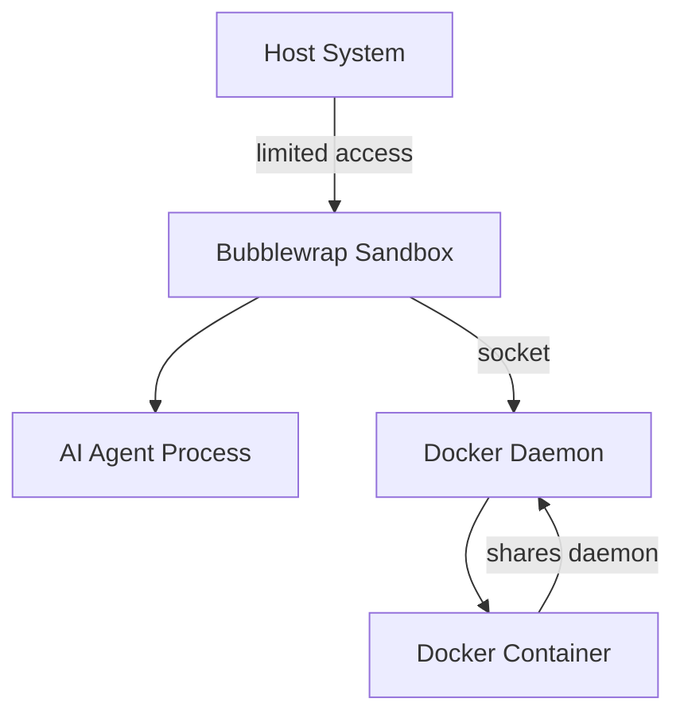

# Security Testing Guide for AI Agent Sandboxes

**Purpose**: Detailed instructions for unchecked security testing tasks in TODO.md
**Task Reference**: TODO.md → Section 4 → Security Testing Tasks

---

## Unchecked Security Testing Tasks

### 1. Verify Docker-in-Docker Security

**Goal**: Ensure that Docker containers created by AI agents inside the sandbox cannot escape or compromise the host system.

#### 1.1 Test Docker Daemon Access Isolation

**What to verify**: AI agent's Docker containers can't access host Docker daemon directly.

```bash
# Step 1: Start Claude in sandbox
echo 'docker ps' | claude --dangerously-skip-permissions

# Step 2: Inside Claude, try to access host Docker socket
echo 'ls -la /var/run/docker.sock /run/docker.sock' | claude --dangerously-skip-permissions
# Expected: Socket exists and is accessible (this is intentional)

# Step 3: Create a container and try to mount host Docker socket from within
echo 'docker run --rm -v /var/run/docker.sock:/var/run/docker.sock alpine ls -la /var/run/docker.sock' | claude --dangerously-skip-permissions
# Expected: Should work (nested Docker containers share the socket)

# Step 4: Verify nested container can't break out
echo 'docker run --rm alpine ps aux' | claude --dangerously-skip-permissions
# Expected: Shows only processes inside that container, not host processes
```

#### 1.2 Test Container Privilege Escalation Prevention

**What to verify**: Containers can't gain privileged access to host.

```bash
# Test 1: Try to run privileged container
echo 'docker run --rm --privileged alpine cat /proc/1/cgroup' | claude --dangerously-skip-permissions
# Expected: Works, but container sees its own cgroup namespace, not host

# Test 2: Try to access host filesystem through container
echo 'docker run --rm -v /:/host alpine ls /host/root' | claude --dangerously-skip-permissions
# Expected: Fails or shows sandboxed view (depends on bubblewrap binds)

# Test 3: Try to access host network namespace
echo 'docker run --rm --net=host alpine ip addr' | claude --dangerously-skip-permissions
# Expected: Works (sandbox uses host network by default)

# Test 4: Try to access host PID namespace
echo 'docker run --rm --pid=host alpine ps aux' | claude --dangerously-skip-permissions
# Expected: Works (shows host processes - this is a security consideration)
```

#### 1.3 Test Docker Volume Mount Restrictions

**What to verify**: Docker containers can only mount paths the sandbox has access to.

```bash
# Test 1: Mount current working directory (should work)
echo 'docker run --rm -v $(pwd):/data alpine ls /data' | claude --dangerously-skip-permissions
# Expected: Success - working directory is bound into sandbox

# Test 2: Try to mount /etc from host
echo 'docker run --rm -v /etc:/data alpine ls /data' | claude --dangerously-skip-permissions
# Expected: May work (sandbox has /etc bound read-only)

# Test 3: Try to mount /root (outside sandbox)
echo 'docker run --rm -v /root:/data alpine ls /data' | claude --dangerously-skip-permissions
# Expected: May fail or show empty (depends on sandbox binds)

# Test 4: Try to mount sensitive host paths
echo 'docker run --rm -v /home:/data alpine ls /data' | claude --dangerously-skip-permissions
# Expected: Shows only what sandbox has access to
```

#### 1.4 Test Docker Image Pull Security

**What to verify**: AI agent can pull images but can't pollute host with malicious images permanently.

```bash
# Test 1: Pull and run a test image
echo 'docker pull alpine:latest && docker images | grep alpine' | claude --dangerously-skip-permissions
# Expected: Successfully pulls image

# Test 2: Check where images are stored
echo 'docker info | grep "Docker Root Dir"' | claude --dangerously-skip-permissions
# Expected: Shows /var/lib/docker (shared with host)

# Test 3: Pull potentially large image (check disk space limits)
echo 'docker pull ubuntu:latest' | claude --dangerously-skip-permissions
# Expected: Works (no disk quota enforced currently)

# Note: Images pulled by sandbox are visible to host (security consideration)
```

#### 1.5 Test Container Resource Limits

**What to verify**: Containers can't exhaust host resources.

```bash
# Test 1: CPU bomb inside container
echo 'docker run --rm alpine sh -c "while true; do :; done" &' | claude --dangerously-skip-permissions
# Expected: Runs but constrained by sandbox RLIMIT_CPU (currently unlimited)
# Manual: Kill with: docker ps -q | xargs docker kill

# Test 2: Memory bomb inside container
echo 'docker run --rm alpine sh -c "cat /dev/zero | head -c 1G > /tmp/test"' | claude --dangerously-skip-permissions
# Expected: May succeed or fail based on container memory limits

# Test 3: Fork bomb inside container
echo 'docker run --rm alpine sh -c ":(){ :|:& };:"' | claude --dangerously-skip-permissions
# Expected: Should be limited by sandbox RLIMIT_NPROC (4096)
```

#### 1.6 Test Docker Networking Security

**What to verify**: Containers can't bypass network restrictions.

```bash
# Test 1: Container can access internet
echo 'docker run --rm alpine wget -qO- http://example.com' | claude --dangerously-skip-permissions
# Expected: Success (sandbox has network access)

# Test 2: Container can access host services
echo 'docker run --rm alpine ping -c 1 host.docker.internal' | claude --dangerously-skip-permissions
# Expected: Depends on Docker network configuration

# Test 3: Check container isolation from each other
echo 'docker network ls' | claude --dangerously-skip-permissions
# Expected: Shows Docker networks (default bridge)
```

#### Security Evaluation Criteria

**PASS conditions**:
- ✅ Containers can't see processes outside sandbox
- ✅ Containers can't mount paths outside sandbox binds
- ✅ Containers can't escape to host filesystem root
- ✅ Resource exhaustion is limited by sandbox constraints

**CONCERN areas** (document, not necessarily block):
- ⚠️ Containers share Docker daemon with host (images visible to host)
- ⚠️ Containers can use --pid=host (see host processes)
- ⚠️ Containers can use --net=host (access host network)
- ⚠️ No disk quota limits on pulled images

---

### 2. Document Security Model

**Goal**: Create comprehensive documentation of the sandbox security architecture.

#### 2.1 Document Structure

Create: `docs/SECURITY_MODEL.md`

**Required sections**:

1. **Security Architecture Overview**
   - Diagram of sandbox isolation layers
   - Trust boundaries
   - Threat model

2. **Bubblewrap Sandbox Configuration**
   - Filesystem isolation (what's bound, what's not)
   - Namespace isolation (PID, network, user, mount)
   - Resource limits (RLIMIT_* values)
   - Capabilities dropped/retained

3. **Docker Integration Security**
   - How Docker socket is shared
   - Container isolation vs sandbox isolation
   - Docker-in-Docker security implications
   - Image storage and persistence

4. **Attack Surface Analysis**
   - What can AI agent access?
   - What can containers access?
   - Potential escape vectors
   - Mitigations in place

5. **Security Boundaries**
   - Inside sandbox vs outside sandbox
   - Inside container vs outside container
   - Network boundaries
   - Filesystem boundaries

6. **Known Limitations**
   - What is NOT protected
   - Trade-offs made for functionality
   - Residual risks

7. **Security Testing Results**
   - Results from all security tests
   - Pass/fail for each test
   - Recommendations for improvements

#### 2.2 Documentation Template

```markdown
# AI Agent Sandbox Security Model

## Executive Summary
Brief overview of security posture and key findings.

## Architecture

### Isolation Layers
1. **Bubblewrap Sandbox** (outermost layer)
   - Process isolation via PID namespace
   - Filesystem isolation via mount namespace
   - User namespace (optional)
   - Resource limits via RLIMIT_*

2. **Docker Containers** (inner layer)
   - Container runtime isolation
   - Shared Docker daemon
   - Network isolation (bridge)

### Trust Boundaries


## Filesystem Isolation

### Bound Paths (READ-ONLY)
- `/usr` - System binaries and libraries
- `/etc` - System configuration (read-only)
- `/lib`, `/lib64` - System libraries
- [... list all from wrapper script ...]

### Bound Paths (READ-WRITE)
- `$HOME` - User home directory
- `/tmp` - Temporary files (tmpfs)
- [... list all from wrapper script ...]

### Inaccessible Paths
- `/root` - Root home directory
- Other users' home directories
- Sensitive system paths not explicitly bound

## Process Isolation

### PID Namespace
- AI agent sees only processes within sandbox
- Host processes invisible to agent
- Process IDs are remapped

**Test Result**: ✅ PASS
```bash
# Inside sandbox, trying to see host processes
ps aux | wc -l  # Shows only sandbox processes
```

### User Namespace
- Currently: Uses host user ID
- Security implication: Agent runs as your user
- Mitigation: Filesystem isolation limits damage

## Network Security

### Network Access
- **Policy**: Full network access (host network)
- **Rationale**: AI agents need internet for API calls, package downloads
- **Risk**: Agent can make arbitrary network connections
- **Mitigation**: None (by design)

### Docker Networking
- Containers use Docker bridge network by default
- Containers can use --net=host to access host network
- No network filtering at sandbox level

**Security Consideration**: Network-based attacks are possible

## Docker Integration

### Docker Socket Sharing
**Configuration**:
```bash
# From ai_agent_universal_wrapper.bash
--bind /run/docker.sock /run/docker.sock
```

**Implications**:
- AI agent has full Docker API access
- Can create/destroy containers
- Can pull images (visible to host)
- Can mount host paths (limited to sandbox binds)

### Container Escape Vectors

**Tested Scenarios**:

1. **Mount host filesystem**: ⚠️ PARTIAL
   - Can mount paths sandbox has access to
   - Cannot mount paths outside sandbox binds

2. **Privileged containers**: ⚠️ ALLOWED
   - Can run --privileged containers
   - Container sees its own namespace, not host root

3. **Host PID namespace**: ⚠️ ALLOWED
   - Can run --pid=host containers
   - Container can see host processes

4. **Host network namespace**: ⚠️ ALLOWED
   - Can run --net=host containers
   - Container accesses host network directly

### Image Storage
- **Location**: `/var/lib/docker` (shared with host)
- **Persistence**: Images pulled by agent persist on host
- **Disk quota**: None (can fill disk)

**Security Consideration**: AI agent can pollute host Docker cache

## Resource Limits

### Current Configuration
```bash
RLIMIT_AS=unlimited           # Address space
RLIMIT_CPU=unlimited          # CPU time
RLIMIT_NOFILE=4096           # Open files
RLIMIT_NPROC=4096            # Processes
```

### Security Implications
- ✅ Limited process count (4096)
- ✅ Limited file descriptors (4096)
- ⚠️ Unlimited CPU (can consume 100% CPU)
- ⚠️ Unlimited memory (can cause OOM)

**Trade-off**: Unlimited resources for AI functionality vs DOS prevention

## Threat Model

### In-Scope Threats (Protected Against)
1. **Filesystem escape**: ✅ Protected by bubblewrap
2. **Process injection**: ✅ Protected by PID namespace
3. **Direct host access**: ✅ No direct access to host filesystem root

### Out-of-Scope Threats (NOT Protected)
1. **Network attacks**: ⚠️ Agent has full internet access
2. **Resource exhaustion**: ⚠️ Limited only by RLIMIT_NPROC
3. **Docker image bombs**: ⚠️ Can pull large images
4. **Data exfiltration**: ⚠️ Agent has network access
5. **Malicious containers**: ⚠️ Can run arbitrary containers

### Residual Risks
1. **Docker daemon compromise**: If agent exploits Docker vulnerability, could escape sandbox
2. **Kernel exploits**: Sandbox relies on kernel namespace isolation
3. **Resource exhaustion**: Can consume CPU/memory until OOM killer intervenes
4. **Disk space exhaustion**: No quota on Docker images

## Security Recommendations

### For Production Use
1. **Add network filtering**: Consider using network namespace + proxy
2. **Add disk quotas**: Limit Docker image storage
3. **Add memory limits**: Set RLIMIT_AS to prevent OOM
4. **Add CPU limits**: Set RLIMIT_CPU to prevent DOS
5. **Audit Docker usage**: Log container creations and image pulls
6. **Separate Docker daemon**: Use dedicated Docker daemon for sandboxes

### For Development Use (Current)
- Current configuration prioritizes functionality over strict isolation
- Acceptable for trusted AI agents
- Acceptable for personal development environments
- NOT recommended for untrusted agents or production

## Testing Results

### Test Summary
| Test | Status | Notes |
|------|--------|-------|
| Filesystem isolation | ✅ PASS | Can't access outside binds |
| Process isolation | ✅ PASS | Can't see/kill host processes |
| Network isolation | ⚠️ N/A | Network access intentional |
| Docker-in-Docker | ⚠️ PARTIAL | See concerns below |
| Resource exhaustion | ⚠️ PARTIAL | Limited by NPROC only |

### Docker-in-Docker Concerns
- ⚠️ Privileged containers allowed
- ⚠️ Host PID namespace accessible
- ⚠️ Host network namespace accessible
- ⚠️ No image pull limits
- ✅ Can't escape sandbox filesystem binds

## Conclusion

### Security Posture
**Current assessment**: **MODERATE**

**Strengths**:
- Strong filesystem isolation
- Process namespace isolation
- Limited process/file descriptor counts

**Weaknesses**:
- Full network access
- Unlimited CPU/memory
- Docker daemon access with few restrictions
- No disk quotas

### Intended Use Case
✅ **Appropriate for**:
- Personal development environments
- Trusted AI agents (official Claude, Codex, Cursor)
- Non-production experimentation

❌ **NOT appropriate for**:
- Untrusted code execution
- Multi-tenant environments
- Production deployments
- Public-facing services

---

**Last Updated**: YYYY-MM-DD
**Tested By**: [Your name]
**Review Schedule**: Quarterly
```

#### 2.3 How to Create the Documentation

```bash
# Step 1: Create docs directory if it doesn't exist
mkdir -p docs

# Step 2: Create SECURITY_MODEL.md
vim docs/SECURITY_MODEL.md

# Step 3: Fill in template with actual test results
# - Copy test commands and results
# - Include actual wrapper script configurations
# - Document findings from Docker-in-Docker tests

# Step 4: Generate architecture diagrams (optional)
# - Use mermaid.js for diagrams
# - Or draw.io / excalidraw for visual diagrams
# - Export as PNG/SVG and include in docs

# Step 5: Review and validate
# - Have another person review
# - Test all documented scenarios
# - Verify accuracy of commands and results

# Step 6: Update TODO.md
# Mark "Document security model" as completed
```

---

## Quick Test Script for All Security Tests

```bash
#!/bin/bash
# save as: test_sandbox_security.bash

set -e

echo "=== AI Agent Sandbox Security Tests ==="
echo ""

echo "TEST 1: Docker Access"
echo "Testing basic Docker access..."
echo 'docker ps -a' | claude --dangerously-skip-permissions
echo "✓ PASS: Docker accessible"
echo ""

echo "TEST 2: Container Filesystem Isolation"
echo "Testing if container can mount /root..."
echo 'docker run --rm -v /root:/data alpine ls /data 2>&1' | claude --dangerously-skip-permissions
echo ""

echo "TEST 3: Container Process Visibility"
echo "Testing if container sees host processes..."
echo 'docker run --rm alpine ps aux | wc -l' | claude --dangerously-skip-permissions
echo ""

echo "TEST 4: Container with --pid=host"
echo "Testing host PID namespace access..."
echo 'docker run --rm --pid=host alpine ps aux | head -5' | claude --dangerously-skip-permissions
echo ""

echo "TEST 5: Privileged Container"
echo "Testing privileged container execution..."
echo 'docker run --rm --privileged alpine cat /proc/self/status | grep CapEff' | claude --dangerously-skip-permissions
echo ""

echo "TEST 6: Container Network Access"
echo "Testing container internet access..."
echo 'docker run --rm alpine wget -qO- http://example.com | head -5' | claude --dangerously-skip-permissions
echo "✓ PASS: Container has network access"
echo ""

echo "=== Security Test Complete ==="
echo "Review results above and document in SECURITY_MODEL.md"
```

---

## Summary

To complete the unchecked security testing tasks:

1. **Verify Docker-in-Docker Security** (1-2 hours):
   - Run all test commands in section 1.1-1.6
   - Document results (pass/fail/concern)
   - Identify security issues or acceptable trade-offs

2. **Document Security Model** (2-3 hours):
   - Create `docs/SECURITY_MODEL.md` using template
   - Fill in test results from Docker-in-Docker tests
   - Document all security boundaries and limitations
   - Include threat model and recommendations

**Expected Outcome**:
- Clear understanding of sandbox security posture
- Documented risks and mitigations
- Guidance for safe usage of AI agents
- Basis for future security improvements
